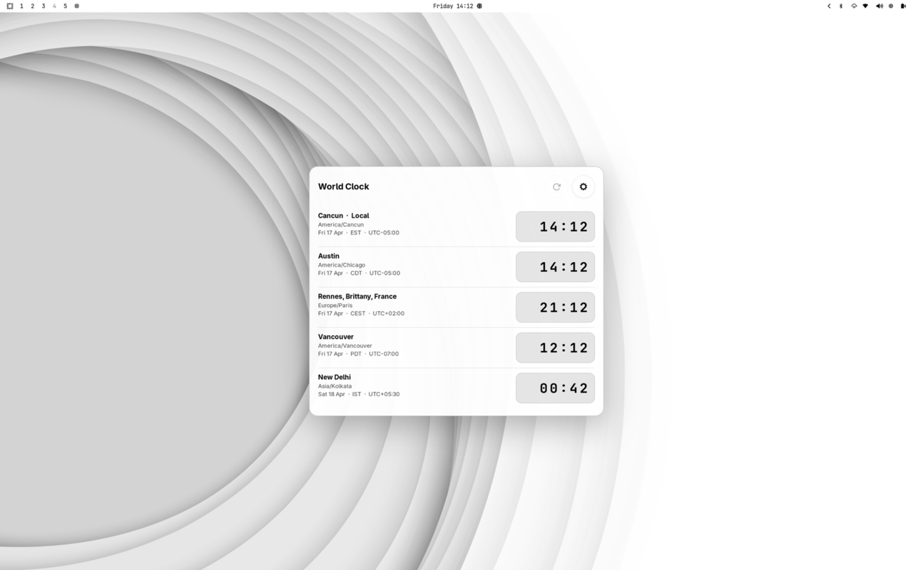
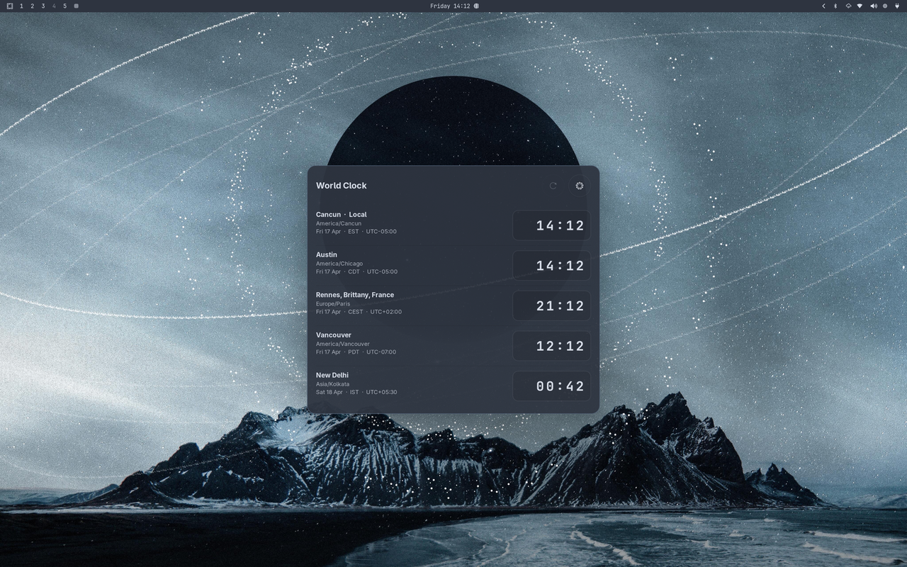
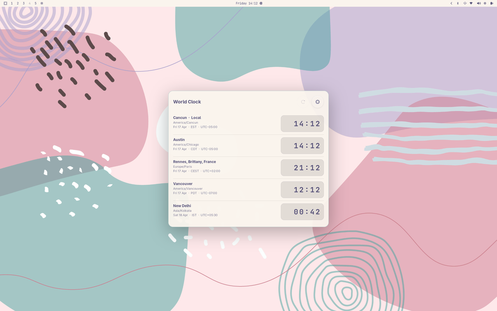

# Omarchy World Clock

Omarchy World Clock adds a small world-clock entry point next to Omarchy's
center Waybar clock and opens a multi-timezone popup for planning across
places.

The implementation is now Rust + GTK4 + `gtk4-layer-shell`. The old Python +
GTK3 app has been removed.

## Screenshots







## What It Does

- Adds a compact world icon next to Omarchy's center Waybar clock.
- Opens a popup with live clocks for a user-managed timezone list.
- Supports manual reference-time conversion across rows.
- Lets you add, remove, pin, and reorder timezones.
- Supports `System`, forced `24h`, and forced `AM/PM` display modes.
- Stores state in `~/.config/omarchy-world-clock/config.json`.

## Install

Recommended install, no Rust toolchain required:

```bash
curl -fsSL https://raw.githubusercontent.com/olivoil/omarchy-world-clock/master/install.sh | bash
```

From a local checkout:

```bash
./install.sh
```

This:

- downloads the latest prebuilt release binary
- installs it under `~/.local/share/omarchy-world-clock`
- writes `~/.local/bin/omarchy-world-clock`
- patches `~/.config/waybar/config.jsonc`
- patches `~/.config/waybar/style.css`
- restarts Waybar

Install a specific release:

```bash
OMARCHY_WORLD_CLOCK_VERSION=v0.1.0 ./install.sh
```

Build from source instead:

```bash
./install.sh --build-from-source
```

## Uninstall

```bash
./uninstall.sh
```

To also remove saved user state:

```bash
./uninstall.sh --purge
```

## Build And Run

Source builds require Rust/Cargo plus GTK4 development packages.

Build:

```bash
cargo build
```

Run the Waybar payload directly:

```bash
cargo run -- module
```

Open the popup:

```bash
cargo run -- popup
```

Toggle the popup:

```bash
cargo run -- toggle
```

Run tests:

```bash
cargo test
```

## Runtime Notes

This repo assumes an Omarchy-like environment with:

- Hyprland
- Waybar
- GTK4
- `gtk4-layer-shell`

Release installs do not require Rust or Cargo on the user's machine. They still
need the GTK runtime libraries. On Arch/Omarchy:

```bash
sudo pacman -S gtk4 gtk4-layer-shell
```

The supported CLI surface is:

- `omarchy-world-clock module`
- `omarchy-world-clock toggle`
- `omarchy-world-clock popup`
- `omarchy-world-clock install-waybar`
- `omarchy-world-clock uninstall-waybar`
- `omarchy-world-clock restart-waybar`

## Configuration

State lives in:

```text
~/.config/omarchy-world-clock/config.json
```

Example:

```json
{
  "version": 3,
  "timezones": [
    {
      "timezone": "America/Cancun",
      "label": "Home",
      "locked": true
    },
    {
      "timezone": "Europe/Paris",
      "label": "Rennes",
      "locked": false
    }
  ],
  "sort_mode": "manual",
  "time_format": "system"
}
```

## Docs

- Product behavior spec: [docs/specs.md](docs/specs.md)
- Maintainer release process: [docs/release.md](docs/release.md)

## Maintainer Release

Releases are published from a local machine, not GitHub Actions. See
[docs/release.md](docs/release.md) for the full checklist.

```bash
scripts/release.sh --description "Adds prebuilt release installs and local release publishing."
```

If you omit the tag, the script uses `v<package.version>` from `Cargo.toml`:

```bash
scripts/release.sh
```

The release script:

- requires a clean git worktree
- releases from the remote default branch, `master`, by default
- uses `Cargo.toml` as the version source of truth
- rejects explicit tags that do not match `v<package.version>`
- writes release notes from `--description` plus the commits since the previous tag
- accepts `--notes-file path/to/notes.md` when you want full manual release notes
- runs `cargo test --locked` and the shell installer tests
- builds `target/release/omarchy-world-clock`
- packages `omarchy-world-clock-<rust-host-target>.tar.gz`
- creates and pushes the git tag if it does not already exist
- creates or updates the GitHub release with the archive and `.sha256`

To check the release before publishing:

```bash
scripts/release.sh --dry-run --description "Short summary of what changed."
```

Dry runs build the package, generate the notes, check tag/release state, and
print the publish actions without creating tags or touching the GitHub release.

Normal release flow:

```bash
git checkout master
git pull --ff-only
# update Cargo.toml version, commit, and push
scripts/release.sh --description "Short summary of what changed."
```

Prerequisites for maintainers:

- Rust/Cargo
- `gh` authenticated for `olivoil/omarchy-world-clock`
- `git`, `tar`, and `sha256sum`
