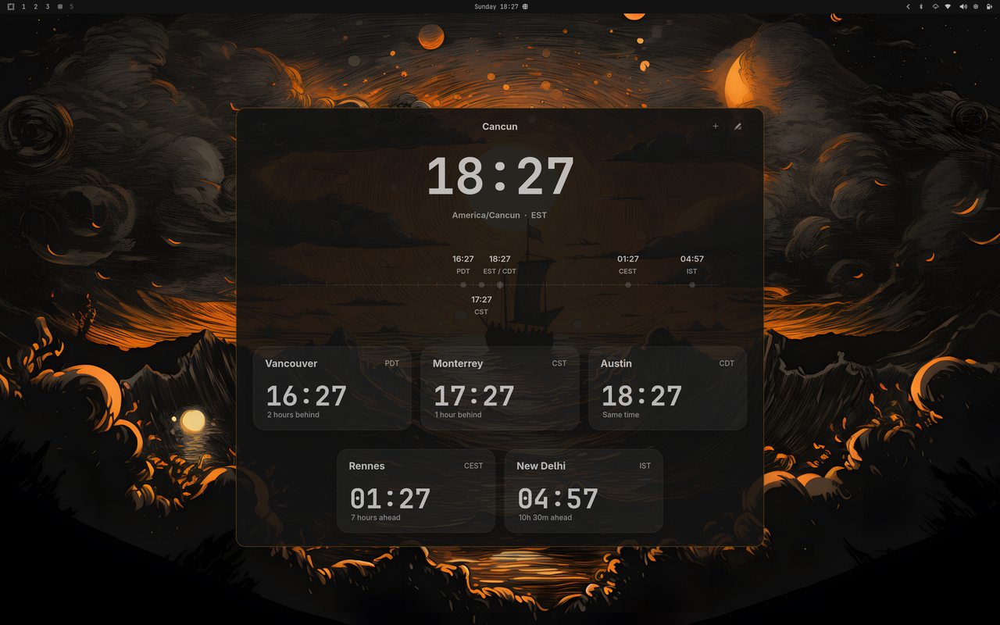
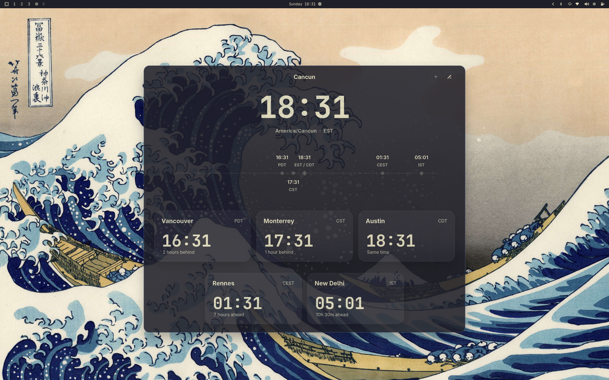

# Omarchy World Clock

Omarchy World Clock adds a small world-clock entry point next to Omarchy's
center Waybar clock and opens a multi-timezone popup for planning across
places.

The implementation is now Rust + GTK4 + `gtk4-layer-shell`. The old Python +
GTK3 app has been removed.

## Screenshots

<p>
  <strong>Rose Pine</strong><br>
  
</p>

<p>
  <strong>Gruvbox</strong><br>
  
</p>

<p>
  <strong>Kanagawa</strong><br>
  
</p>

## What It Does

- Adds a compact world icon next to Omarchy's center Waybar clock.
- Toggles the popup on left click and opens `omarchy-tz-select` on right click.
- Opens a popup with live clocks for a user-managed timezone list.
- Supports manual reference-time conversion across rows.
- Supports city/timezone search, with remote place lookup as a fallback.
- Lets you add, remove, pin, and reorder timezones.
- Supports `System`, forced `24h`, and forced `AM/PM` display modes.
- Adapts popup colors to the active Omarchy theme palette.
- Stores state in `~/.config/omarchy-world-clock/config.json`.

## Install

```bash
./install.sh
```

This:

- installs the Rust binary under `~/.local/share/omarchy-world-clock`
- writes `~/.local/bin/omarchy-world-clock`
- patches `~/.config/waybar/config.jsonc`
- patches `~/.config/waybar/style.css`
- restarts Waybar

## Uninstall

```bash
./uninstall.sh
```

To also remove saved user state:

```bash
./uninstall.sh --purge
```

## Build And Run

Build:

```bash
cargo build
```

Run the Waybar payload directly:

```bash
cargo run -- module
```

Open the popup:

```bash
cargo run -- popup
```

Toggle the popup:

```bash
cargo run -- toggle
```

Run tests:

```bash
cargo test
```

## Runtime Notes

This repo assumes an Omarchy-like environment with:

- Hyprland
- Waybar
- Rust / Cargo
- GTK4
- `gtk4-layer-shell`

The supported CLI surface is:

- `omarchy-world-clock module`
- `omarchy-world-clock toggle`
- `omarchy-world-clock popup`
- `omarchy-world-clock install-waybar`
- `omarchy-world-clock uninstall-waybar`
- `omarchy-world-clock restart-waybar`

## Configuration

State lives in:

```text
~/.config/omarchy-world-clock/config.json
```

Example:

```json
{
  "version": 3,
  "timezones": [
    {
      "timezone": "America/Cancun",
      "label": "Home",
      "locked": true
    },
    {
      "timezone": "Europe/Paris",
      "label": "Rennes",
      "locked": false
    }
  ],
  "sort_mode": "manual",
  "time_format": "system"
}
```

## Docs

- Product behavior spec: [docs/specs.md](docs/specs.md)
