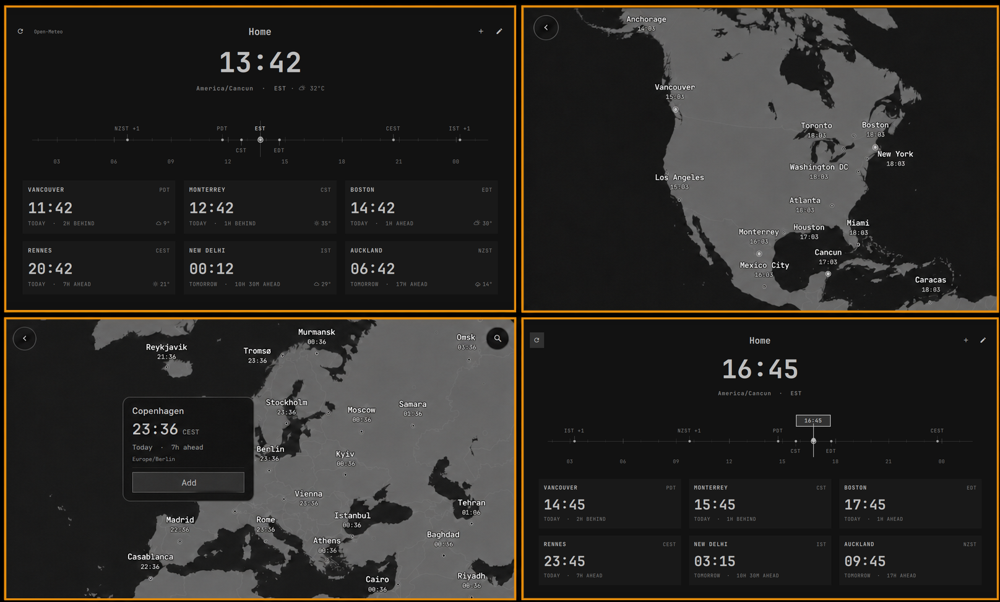

# Omarchy World Clock

A native Omarchy Quattro world clock. Hover over the bar widget icon for a quick view of your timezones, add new timezones, pin one to be always visible, enter any time to convert from one timezone to the others.

<p>
  
</p>

## Install

On Omarchy Quattro:

```bash
omarchy plugin add https://github.com/olivoil/omarchy-world-clock.git --enable
```

The interactive installer asks where to place the widget. 
You can move it after installing at any time:

```bash
# Place it immediately after Omarchy's clock.
omarchy bar move io.github.olivoil.world-clock --after omarchy.clock

# Or place it in a particular section.
omarchy bar move io.github.olivoil.world-clock --section left
```

Use `center` or `right` instead of `left` as needed.

### Update

```bash
omarchy plugin update io.github.olivoil.world-clock
```

### Upgrading from the old AUR release

Versions through `0.3.x` used `omarchy-world-clock-bin` for a separate backend.
If that release already installed the Quattro plugin, update it with the
command above. If it did not, use the normal `omarchy plugin add ... --enable`
command instead.

The new plugin ignores the old `/usr/bin/omarchy-world-clock` executable and bundles its own, so
the AUR package is no longer required.

## Use

- **Left click** the world icon to open or close World Clock.
- **Right click** it to open Omarchy's system-timezone selector and set your local timezone.
- Use the **pencil** to rename, pin, or remove locations. Click a location name
  to edit it, then press **Enter** to save it or **Escape** to cancel. Submit an
  empty name to restore the location's default place name.
- Pin one place to keep its current time always visible beside the bar icon.
- Select a displayed time and enter another time to convert the same instant
  across every visible place.
- Use **plus** to open the full-panel globe. Start typing or select **search**
  to find a city or timezone, or rotate the globe and choose a place directly.
- Use **refresh** to return a converted view to live time.

## Features

- Up to nine non-local places in a compact three-column view.
- A proportional timezone timeline with day and offset context.
- Multiple named places in the same timezone, such as Boston and New York.
- Personal labels for saved locations, such as a person's name or "Home".
- One pinned home/place clock in the bar.
- Manual time conversion with DST-aware IANA timezone handling.
- Local timezone and alias search that works offline.
- Optional Open-Meteo city search for queries not resolved locally.
- A high-resolution, full-panel shader-rendered globe with detailed Natural
  Earth 1:10m coastlines, type-to-search, live major-city suggestions,
  drag-to-rotate, extended mouse-wheel or trackpad zoom, and offline
  click-to-add.
- Automatic 12/24-hour display matching the Omarchy clock or system locale.
- Persistent state in `~/.config/omarchy-world-clock/config.json`.

## Why QML and Rust?

QML is the frontend because Quattro is a Quickshell/QML shell. It is what lets
World Clock use the same panel, bar, focus, keyboard, and theme primitives as
built-in Omarchy widgets. This frontend is native shell code rather than a
separate desktop window.

Rust is used as a small headless backend for arbitrary IANA timezone conversion, DST edge cases, config
migration and atomic writes, place search, HTTP fallback, and coordinate to
timezone lookup.

See [Architecture](docs/architecture.md) for the component boundary, JSON
protocol, packaging, etc.

## Configuration

State is written to:

```text
~/.config/omarchy-world-clock/config.json
```

Example:

```json
{
  "version": 6,
  "pinned_location": {
    "timezone": "Europe/Paris",
    "label": "Rennes"
  },
  "timezones": [
    {
      "timezone": "America/Cancun",
      "label": "Home",
      "latitude": 21.1619,
      "longitude": -86.8515
    },
    {
      "timezone": "Europe/Paris",
      "label": "Rennes",
      "latitude": 48.1173,
      "longitude": -1.6778
    }
  ]
}
```

To keep all search local, add:

```json
{
  "disable_open_meteo_geolocation": true
}
```

Existing coordinates remain usable when remote search is disabled.

## Privacy and third-party data

Local timezone searches and map clicks do not call a remote service. When a
typed place query has no local result, World Clock may send that query directly
from the user's machine to Open-Meteo's Geocoding API. Remote results are
attributed in the panel. Set `disable_open_meteo_geolocation` to `true` to opt
out.

See Open-Meteo's [Terms & Privacy](https://open-meteo.com/en/terms) and
[Licence](https://open-meteo.com/en/licence).

## Uninstall

```bash
omarchy plugin remove io.github.olivoil.world-clock
```

This removes the plugin but preserves saved places. Delete
`~/.config/omarchy-world-clock/config.json` separately only if you also want to
discard that state.

## Development

Build and test the source backend:

```bash
cargo build --locked --bin omarchy-world-clock-backend
cargo test --locked
```

Exercise the JSON protocol:

```bash
cargo run --locked --bin omarchy-world-clock-backend -- module
cargo run --locked --bin omarchy-world-clock-backend -- snapshot
```

Rebuild checked-in artifacts after relevant source or dependency changes:

```bash
scripts/build-timezone-grid.sh       # only when map source/data changes
scripts/build-plugin-backend.sh      # whenever backend inputs change
```

Artifact reproduction requires Podman or Docker. The scripts use a
digest-pinned official Rust/Alpine image and produce a static x86-64 Linux
backend; users installing the plugin need neither the container engine nor a
Rust toolchain.

Run every release check, including byte-for-byte artifact reproduction and
Quattro validation when Omarchy tooling is available:

```bash
scripts/ci.sh
```

The same source and reproducibility checks run in GitHub Actions on pull
requests and changes to `master`; QML validation additionally runs on the
maintainer's Omarchy system.

The committed backend is intentionally part of the plugin distribution. See
[`bin/README.md`](bin/README.md) for its provenance and verification files.

## Support policy

New releases target Omarchy Quattro on x86-64 Linux. Omarchy 3/Waybar is
not part of the new plugin architecture; users who need it can remain on the
older AUR release.

## Documentation

- [Architecture and packaging](docs/architecture.md)
- [Product behavior specification](docs/specs.md)
- [Maintainer release process](docs/release.md)
- [Timezone map data and attribution](data/README.md)

## License

The application source is MIT licensed. The derived timezone map database is
licensed under ODbL 1.0; see [`data/ODbL-1.0.txt`](data/ODbL-1.0.txt). The
plugin manifest expresses the combined distribution as `MIT AND ODbL-1.0`.

Omarchy World Clock is an unofficial project and is not affiliated with
Basecamp or the Omarchy project.
